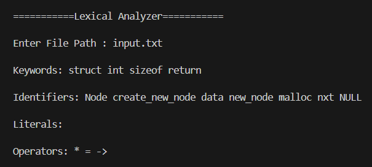
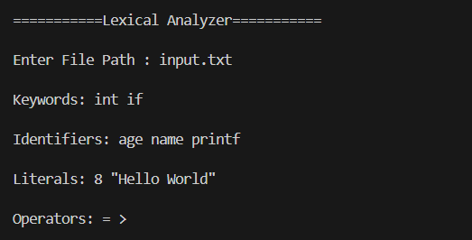

# Lexical Analyzer  in C

- **Name:** `SURBHI TARWEY`  
- **Company:** `CODTECH IT SOLUTIONS`  
- **ID:** `CT04DG1759`  
- **Domain:** `C Programming`  
- **Internship Duration:**  `June 14th, 2025` – `July 14th, 2025` 

---

##  Project Overview

This is a **Lexical Analyzer** written in C that reads a C source code file and identifies the **keywords**, **identifiers**, **literals**, and **operators**. It uses basic file handling, string processing, and tokenization techniques.

The analyzer simulates a fundamental component of a compiler that breaks code into meaningful units (tokens).

---
## Screenshots

  <table>
    <tr>
      <td></td>
      <td></td>
    </tr>
  </table>

---

##  Features

- Input any valid C source file
- Identifies and extracts:
  - **Keywords** (e.g., `int`, `return`)
  - **Identifiers** (user-defined names)
  - **Literals** (numbers, string literals)
  - **Operators** (e.g., `+`, `==`, `<=`)
- Avoids duplicates using uniqueness check
- Lightweight and works via command line

---

## Tech Used
>  C Language

